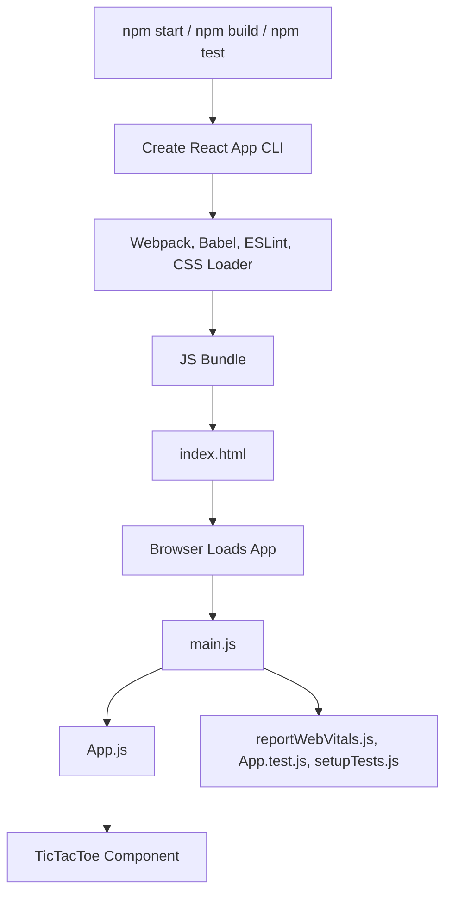

# 🎮 Tic-Tac-Toe (React)

A simple, elegant Tic-Tac-Toe game built as a single-page React application. Play classic noughts and crosses right in your browser, with a clean UI and smooth gameplay. No backend, no tracking—just pure front-end fun.

---

## 🗺️ Workflow Diagram



---

## ✨ Features

- **Instant Gameplay:** Play Tic-Tac-Toe in your browser—no install or backend needed.
- **Component-Based:** Built with React for maintainability and reusability.
- **Live State:** Interactive UI updates as you play—responsive to every move.
- **CRA Powered:** Uses Create React App (CRA) for easy local development and build.
- **Performance Metrics:** Optionally hooks into browser performance APIs.
- **Ready for Testing:** Comes with a basic test setup (Jest + React Testing Library).

---

## 🚀 Getting Started

### Prerequisites

- [Node.js](https://nodejs.org/) (v14+ recommended)
- [npm](https://www.npmjs.com/) or [yarn](https://yarnpkg.com/)

### Installation & Running Locally

1. **Clone the repository:**
   ```bash
   git clone https://github.com/sinha-19/tic-tac-toe.git
   cd tic-tac-toe
   ```

2. **Install dependencies:**
   ```bash
   npm install
   # or
   yarn install
   ```

3. **Start the development server:**
   ```bash
   npm start
   # or
   yarn start
   ```
   Open [http://localhost:3000](http://localhost:3000) in your browser.

4. **Build for production:**
   ```bash
   npm run build
   ```

5. **Run tests:**
   ```bash
   npm test
   ```

---

## 🗂️ Project Structure

```
tic-tac-toe/
├── public/
│   ├── index.html
│   ├── manifest.json
│   └── ...
├── src/
│   ├── App.js
│   ├── index.js
│   ├── Components/
│   │   └── TicTacToe/
│   │       ├── TicTacToe.jsx
│   │       └── TicTacToe.css
│   ├── Assets/
│   ├── reportWebVitals.js
│   ├── setupTests.js
│   └── App.test.js
├── package.json
├── README.md
└── ...
```

---

## 🧩 Key Components

- **App.js:** Root React component, imports and renders the TicTacToe game.
- **Components/TicTacToe:** Contains main game logic, state, and UI grid.
- **public/index.html:** The single entry point for the app.
- **reportWebVitals.js:** (Optional) Hooks for performance measurement.
- **App.test.js / setupTests.js:** Ready-to-use tests for your components.

---

## 🛠️ Build & Tooling

- **Create React App:** Handles all build, serve, and test tooling.
- **Webpack/Babel:** Bundles and transpiles your JavaScript and JSX.
- **Hot Reloading:** See your code changes instantly in development.
- **CRA Scripts:** Standard `start`, `build`, `test` commands.

---

## 🌐 Live Demo

Try it instantly: [https://realtime-chat-e2mr.vercel.app/](https://realtime-chat-e2mr.vercel.app/)

---

## 🤝 Contributing

Contributions/PRs are always welcome! Feel free to open issues for bugs or feature requests.

---

## 👤 Author

Developed and maintained by [Saket Kumar Sinha](https://github.com/sinha-19).

---

> _Play, learn, and enjoy—Tic-Tac-Toe, powered by React!_
